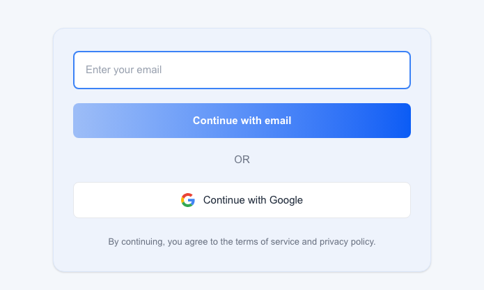
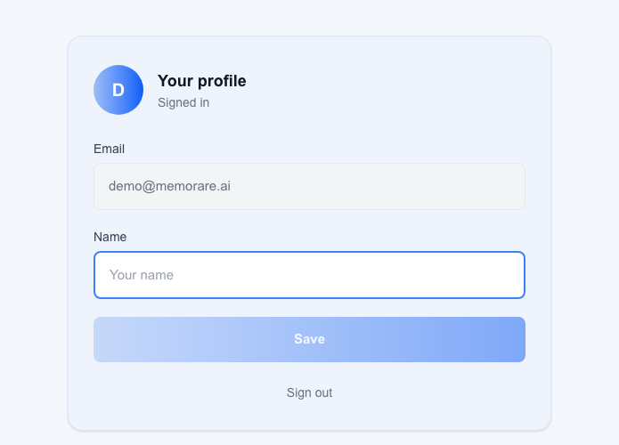
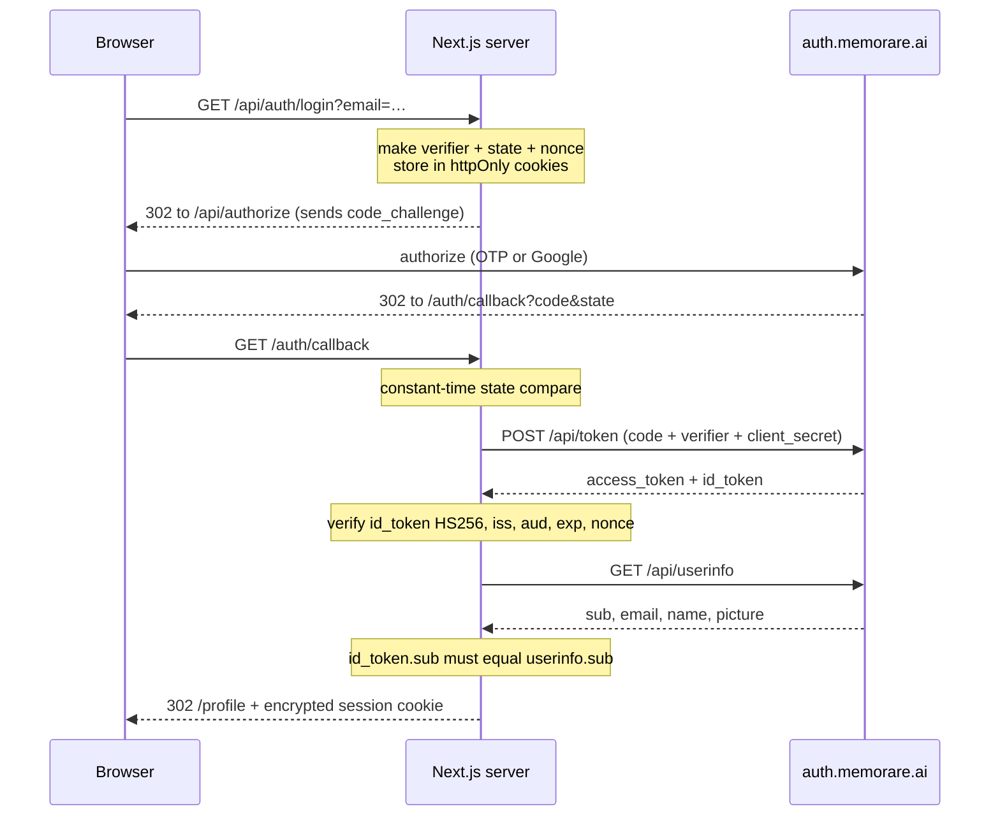

# Memorare Auth + Profile Integration

Next.js app that signs users in through the Memorare Identity Provider (OAuth 2.0 authorization code + PKCE S256), shows their profile, and lets them change their name and photo.

**Live demo: https://test.vault-mind.com**

[](https://github.com/mashr9980/memorare-oidc-app/actions/workflows/ci.yml)

| Sign in | Profile |
|---|---|
|  |  |

Every token exchange, every provider call, and every secret stays on the server. The browser only ever receives an encrypted session cookie it cannot read.

## What is where

| Requirement | Where it lives |
|---|---|
| Next.js + React | `next@16`, `react@19`, App Router under `app/` |
| Login screen matching the mockup | `app/page.tsx` |
| Email sign-in (`login_hint` → OTP) | `app/api/auth/login/route.ts` |
| Google sign-in (`idp=google`) | same route, mutually exclusive with `login_hint` |
| PKCE S256 + `state` | `lib/pkce.ts`, verified in `app/api/auth/callback/route.ts` |
| Code exchange with `client_secret` | `lib/memorare.ts` (server only) |
| Profile: email read-only, name editable | `app/profile/` |
| Save name (`PATCH /api/profile`) | `app/api/profile/route.ts` |
| Silent SSO (`prompt=none` → `login_required`) | `app/api/auth/sso/route.ts` |
| Secrets never in the browser | no `NEXT_PUBLIC_*`, no client-side provider calls |
| Nginx + Let's Encrypt TLS | `deploy/nginx.conf` |
| **Bonus:** avatar upload | `app/api/profile/avatar/route.ts` → Amazon S3 |
| **Bonus:** `id_token` verification | `lib/id-token.ts` |
| **Bonus:** end-to-end tests + CI | `e2e/`, `.github/workflows/ci.yml` |

## How sign-in works



`client_secret` and `code_verifier` never leave the Node process. The session cookie is a JWE (`dir` + `A256GCM`), so the access token inside it is opaque even to whoever holds the cookie.

## Avatar upload

The provider offers `POST /api/profile/avatar`, and this app implements that path against Amazon S3 instead, then writes the resulting URL back to the provider profile so other Memorare apps see it too.

```
browser ──multipart──▶ /api/profile/avatar
                         │  1. session required
                         │  2. ≤ 2MB
                         │  3. magic-byte sniff (not the Content-Type header)
                         │  4. sharp → 512×512 WebP, EXIF dropped
                         ▼
                       S3 (private bucket, SSE-AES256)
                         key: avatars/{sub}.webp
                         │
                         ▼
                       PATCH /api/profile {"picture": "https://…/api/avatar/{sub}?v=…"}

anyone ────GET────▶ /api/avatar/{sub}  ──302──▶ presigned S3 URL (5 min)
```

Four decisions worth calling out:

**The bucket is private and stays private.** Public-read would be one line less code, but then every avatar is world-enumerable forever. Instead the app hands out a 5-minute presigned URL per request behind a stable address, so the URL stored on the provider profile never expires while the objects are never publicly readable.

**Content type is sniffed, not trusted.** A file can claim `image/png` and contain SVG with a `<script>` tag. `sniffImageType()` reads the actual magic bytes and rejects anything that is not JPEG, PNG or WebP.

**Every image is re-encoded.** `sharp` converts to WebP at 512×512, which normalises the format and drops EXIF, including the GPS coordinates phone cameras attach to photos. Uploading someone's holiday snap should not publish where they took it.

**The key is derived from `sub`, so there is no database.** One avatar per user, overwritten in place, cache-busted by a content hash in the `?v=` parameter. `isSafeSub()` constrains the subject to `[A-Za-z0-9_-]{1,64}` so a hostile subject cannot escape the `avatars/` prefix.

If `AVATAR_BUCKET` is unset the route forwards the file to the provider's own avatar endpoint instead, so the app is correct with or without AWS.

## Silent single sign-on

Auth is a shared identity provider, so someone arriving from another Memorare app usually already has a session there. Before rendering the form, the app makes one `prompt=none` authorize round trip carrying neither `login_hint` nor `idp`, exactly as the flow documentation describes.

If the provider recognises the visitor it returns a code and they land on their profile without clicking anything. If it answers `error=login_required` the app shows the normal form with no error banner, because nothing actually went wrong. A `mem_sso` cookie records that the attempt happened, so a visitor with no provider session sees the form once rather than bouncing through a redirect loop. Signing out clears it, since the provider session ends too.

## Other decisions

**Email sign-in is a POST.** A GET would write the address into browser history and every proxy log along the way, and any link prefetcher following it would make the provider send an OTP nobody asked for. The Google button stays a GET, since it carries no personal data.

**`SameSite=Lax`, not `Strict`.** The callback arrives as a cross-site top-level GET. Under `Strict` the browser withholds the `state` cookie and every sign-in fails with a state mismatch.

**`__Host-` prefix on the session cookie over HTTPS.** It pins the cookie to the exact origin, so no sibling subdomain can overwrite it. The prefix requires `Secure`, so plain-HTTP local dev keeps the bare name and readers accept either.

**No refresh token handling.** Discovery advertises `grant_types_supported: ["authorization_code"]` only, and asking for `refresh_token` returns `unsupported_grant_type`. Access tokens last 24h; when one expires the app clears the session and sends the user back through authorize, which the provider's SSO session makes quick.

**`id_token` is verified with the client secret.** Discovery publishes `HS256` and no `jwks_uri`, so the shared secret is the signing key. That forces verification onto the server, where the secret already lives.

**Discovery is not fetched at runtime.** The document sits at `/api/.well-known/openid-configuration` rather than the RFC 8414 location, so a generic discovery client would not find it. Endpoints are configured directly and the observed values are pinned in `lib/id-token.ts`.

## Running it locally

```bash
npm install
cp .env.example .env.local     # placeholders work against the mock provider
npm run dev
```

Open http://localhost:3000. With no real credentials the app talks to `mock/idp.js`, a standalone provider that implements the documented contract and enforces it strictly: S256 verification, one-time codes, client authentication, `{error, error_description}` bodies, and `idp=google` rejected alongside `login_hint`. The Google path shows a minimal account chooser, the way Google itself does, so two different testers using the Google button never collide on one identity the way two different email addresses would if the mock skipped that step.

```bash
node mock/idp.js    # 127.0.0.1:9000, started separately
```

### Tests

```bash
npm run typecheck   # tsc
npm run lint        # eslint
npm test            # unit: PKCE vectors, session sealing, avatar rules
npm run test:e2e    # Playwright: the real flow in a real browser
```

`tests/pkce.test.ts` checks the S256 challenge against the RFC 7636 worked example. `tests/session.test.ts` proves a tampered or foreign-key cookie fails to open. `tests/avatar-rules.test.ts` covers the sniffer and the subject whitelist.

The Playwright suite drives Chromium through both sign-in paths, saves a name, uploads and removes a photo, signs out, and exercises silent SSO in both directions. Two of its checks are about secrets rather than features: one asserts the session cookie is `httpOnly` and invisible to `document.cookie`, the other scrapes every document and static chunk the browser downloads and fails if a secret appears in any of them.

`.github/workflows/ci.yml` runs all of that on every push, plus `scripts/check-bundle-secrets.sh`, which builds with sentinel secrets and greps the entire output for them.

## Environment

| Variable | Purpose |
|---|---|
| `AUTH_BASE` | Provider origin. `https://auth.memorare.ai` in production |
| `MEMORARE_CLIENT_ID` | Issued by Memorare |
| `MEMORARE_CLIENT_SECRET` | Issued by Memorare. Server only |
| `MEMORARE_REDIRECT_URI` | Must match the registered value exactly |
| `APP_URL` | Public origin, used for redirects behind the proxy |
| `SESSION_SECRET` | ≥ 32 chars, encrypts the session cookie |
| `AVATAR_BUCKET` | Optional. S3 bucket for avatars |
| `AWS_REGION` | Optional. Defaults to `us-east-1` |

No AWS keys. The EC2 instance carries an IAM role whose only permission is `PutObject`, `GetObject` and `DeleteObject` on `arn:aws:s3:::<bucket>/avatars/*`.

## Deploying

Nginx terminates TLS and proxies to Next.js on loopback. Ports 3000 and 9000 are never exposed.

```bash
git pull
npm ci
npm run build
rm -rf .next/cache          # Turbopack snapshots env values into its cache
sudo systemctl restart memorare-app
```

`GET /healthz` is a liveness probe. `/api/auth/` is rate limited to 12 requests a minute per address, because each sign-in redirect makes the provider send an OTP email. `client_max_body_size` is 3MB, just above the app's own 2MB avatar rule, so oversized uploads get the app's JSON error rather than the proxy's HTML page.

First-time setup lives in `deploy/`: `nginx-http.conf` to answer the ACME challenge, `certbot --nginx -d <host>`, then `nginx.conf` for the TLS listener plus HSTS, `X-Content-Type-Options`, `X-Frame-Options` and `Referrer-Policy`. `memorare-app.service` runs Next.js as a systemd unit bound to `127.0.0.1:3000`.

## Switching to real credentials

The demo currently signs in against the bundled mock provider, because client credentials have not been issued yet. Moving to the real one is a config change, not a code change:

```diff
- AUTH_BASE=https://test.vault-mind.com/mock-idp
+ AUTH_BASE=https://auth.memorare.ai
  MEMORARE_CLIENT_ID=<issued>
  MEMORARE_CLIENT_SECRET=<issued>
  MEMORARE_REDIRECT_URI=https://test.vault-mind.com/auth/callback
```

Then drop the `/mock-idp/` block from the nginx config and restart. `/auth/callback` is already served at the path Memorare registers.
